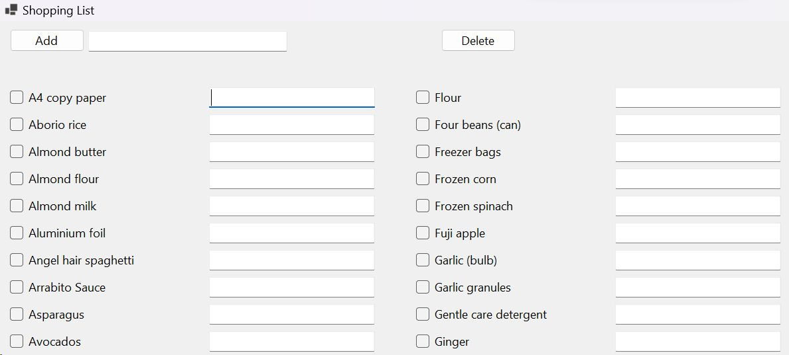

# Shopping List App

## Overview

The Shopping List App is a simple Windows Forms application that allows users to create, manage, and print shopping lists. With this app, you can easily keep track of items you need to purchase, mark items as selected, add annotations, and print your shopping list.

## Features

- **Add Items**: Quickly add items to your shopping list by entering their names.
- **Checkboxes**: Each item on the list has its own checkbox, allowing you to mark items as selected.
- **Annotations**: Add annotations to items for additional notes or details.
- **Delete Items**: Easily remove selected items from the list.
- **Print Shopping List**: Print a neatly formatted shopping list with selected items and annotations.
- **Scrollable List**: The app includes a scrollable list to accommodate a large number of items.

## Installation

To run the Shopping List App on your Windows machine, follow these steps:

1. **Install .NET Framework**: Ensure you have the .NET Framework installed on your computer. If it's not already installed, you can download it from [Microsoft's .NET website](https://dotnet.microsoft.com/download).

2. **Clone the Repository**: Clone this repository to your local machine using Git or download the ZIP file and extract it.

3. **Compile and Run**: Open the solution in Visual Studio or your preferred C# development environment and compile the project. Then, run the application.

4. **Start Using the App**: Once the app is running, you can start adding items to your shopping list, mark them as selected, add annotations, and use the available features.

## Contributing

If you'd like to contribute to the development of this app, feel free to fork this repository, make improvements, and submit a pull request.

**Note:** This is a simple shopping list application created as a learning project. It may be extended with additional features in the future.